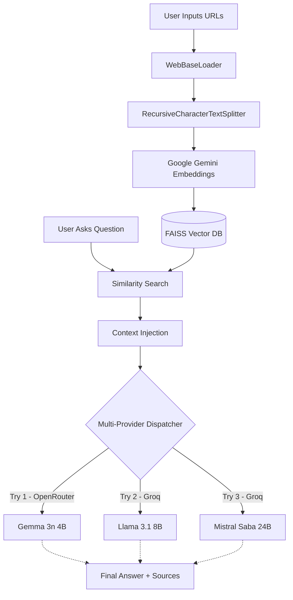

# 🔍 FinSight AI: Modern News Research Tool

[](https://streamlit.io/)
[](https://langchain.com/)
[](https://openrouter.ai/)

**FinSight AI** is a professional-grade financial news analysis tool that leverages state-of-the-art LLMs to perform semantic research across multiple web articles. Designed for investors, researchers, and analysts, it transforms raw URLs into a searchable knowledge base.

## 📸 Output Screenshots

| Landing Page | Query Result |
|:---:|:---:|
|  |  |

---

## 🏗️ Architecture & Workflow

The system follows a classic **RAG (Retrieval-Augmented Generation)** pipeline, optimized for speed and resilience through multi-model failover.



---

## 🛠️ Tech Stack

- **Frontend**: [Streamlit](https://streamlit.io/) (Custom Dark-Themed UI)
- **Framework**: [LangChain](https://www.langchain.com/) (Orchestration & Chains)
- **Embeddings**: [Google Gemini (embedding-001)](https://ai.google.dev/)
- **Vector Store**: [FAISS](https://github.com/facebookresearch/faiss) (Facebook AI Similarity Search)
- **LLM Providers**: 
  - [OpenRouter](https://openrouter.ai/) — Gemma 3n 4B
  - [Groq](https://groq.com/) — Llama 3.1 8B Instant & Mistral Saba 24B
- **Environment**: Python 3.10+

---

## 🔬 Implementation Details

### 1. Data Processing & Chunking
To handle large financial articles without exceeding context windows or hitting rate limits:
- **Chunk Size**: 1000 characters
- **Overlap**: 200 characters
- **Retrieval (k)**: Top 8 most relevant chunks per query
- **Splitter**: `RecursiveCharacterTextSplitter` using intelligent separators (`\n\n`, `\n`, `.`, `,`).

### 2. Multi-Provider Failover Logic
FinSight AI rotates across **multiple AI providers** for maximum reliability:
1. **Gemma 3n 4B** via OpenRouter — lightweight and fast, tried first.
2. **Llama 3.1 8B Instant** via Groq — ultra-fast inference, second fallback.
3. **Mistral Saba 24B** via Groq — high-quality reasoning, final safety net.

> This multi-provider approach ensures that even if one platform (e.g., OpenRouter) is rate-limited, the app seamlessly switches to Groq and vice versa.


### 3. Vector Storage
Unlike traditional databases, FAISS performs **Semantic Search**. It doesn't just look for keywords; it understands the *meaning* of your question and finds the most relevant paragraphs from the articles.

---

## 🚀 Installation & Local Setup

### Prerequisites
- Python 3.10 or higher
- [OpenRouter API Key](https://openrouter.ai/keys)
- [Groq API Key](https://console.groq.com/keys)
- [Google Gemini API Key](https://aistudio.google.com/app/apikey) (for embeddings)

### Step 1: Clone & Navigate
```bash
git clone https://github.com/your-username/finsight-ai.git
cd finsight-ai
```

### Step 2: Virtual Environment
```bash
# Windows
python -m venv .venv
.venv\Scripts\activate

# Mac/Linux
python3 -m venv .venv
source .venv/bin/activate
```

### Step 3: Install Dependencies
```bash
pip install -r requirements.txt
```

### Step 4: Configuration
Create a `.env` file in the root directory:
```env
GOOGLE_API_KEY=your_gemini_key
OPENROUTER_API_KEY=your_openrouter_key
GROQ_API_KEY=your_groq_key
```

### Step 5: Run the App
```bash
streamlit run main.py
```

---

## 🖥️ Production-Grade Features
- **Responsive UI**: Built with custom CSS for a premium glassmorphic dark theme.
- **Multi-Provider Rotation**: Seamlessly rotates between OpenRouter and Groq providers for maximum uptime.
- **Source Citation**: Every answer includes clickable links to the exact articles used as context.
- **Self-Healing**: Automatic retry logic for both embedding generation and LLM queries.

---

*Built by Harsh Kumar IIIT SriCity , Heymyselfharsh@gmail.com.*
